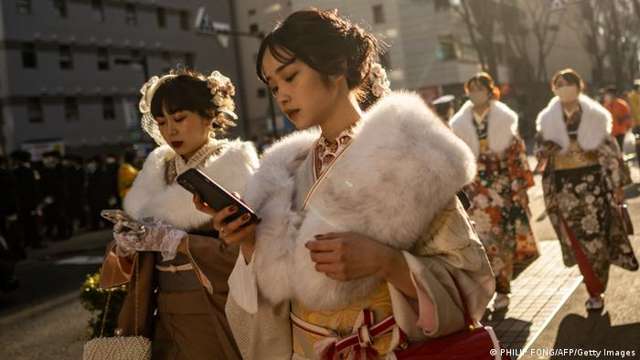
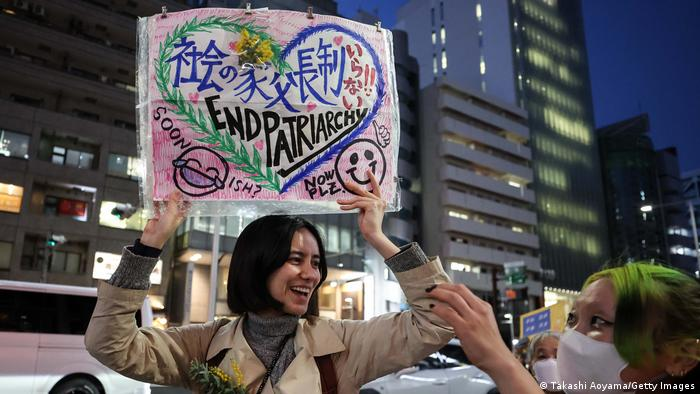
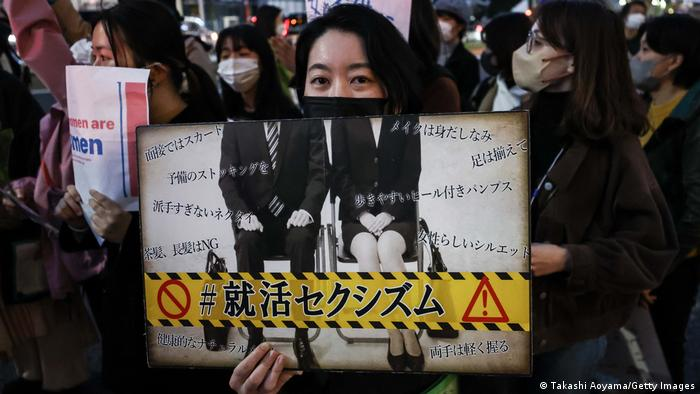

# 民调：八成日本人认为日本重男轻女

Author: None (Language: zh)

Publisher: None

Time: 2023-05-07T07:14:00Z

Description: 日本内阁府最近发布的一次的调查显示，日本社会在教育、就业、政治和其他各个方面，都存在严重的性别不平等现象。

Videos: []

Images: ["[65332883_303.jpg](https://static.dw.com/image/65332883_303.jpg)", "[65464152_401.jpg](https://static.dw.com/image/65464152_401.jpg)", "[65464125_401.jpg](https://static.dw.com/image/65464125_401.jpg)"]

Subject: 文化经纬

Subjects: []

Keywords: ['德国之声系列报道：打破藩篱的亚洲女性们']

ID: 65481659

<!--METADATA-->

日本女性在教育、就业、政治等方面遭受诸多不平等待遇

（德国之声中文网）将近80%的日本人认为这个亚洲国家的社会重男轻女，这是日本内阁府最近发布的一次的调查结论。调查显示，只有14.7%的居民认为日本的女性受到平等对待。该研究强调了所有领域都存在严重的性别不平等——  从政治到教育到"社会接受的观念、习俗和惯例。

在社会的哪些领域存在最严重的不平等现象？近82%的受访者回答说：政治领域；超过64%的受访者说：工作场所。此外，近60%的人强调了家庭生活：社会习俗规定妇女要做饭、打扫卫生、管理家庭和抚养孩子。

3月8日国际妇女节在东京举行的抗议活动。一名妇女举起标语牌，心形图案内写着：结束父权制。

"民意调查结果并不让我感到惊讶。不幸的是，似乎没有什么变化，没有好转。"广岛大学社会学教授和骚扰案件联系人北中千里（Chisato Kitanaka） 说。

"这在日本社会的各个方面都是一个问题。这可能在收入差异以及女性的就业机会方面最为明显。"她告诉德国之声，"大学毕业的年轻女性拥有与男性相同的技能和知识，但雇用她们的公司和组织往往停留在老旧的思维方式上。"她说，他们认为女性会在几年后离开公司结婚生子，"因此，他们为女性提供与男性员工相同的培训和晋升机会是没有意义的。"

##  日本妇女有话说

##  在教育领域也不平等

在全球议会联盟（IPU）监测的180个国家中，日本排名第165位。在最近的下议院选举中，只有18%的候选人是女性。

至少在教育领域，男女之间是平等的  ——  至少这是长期以来的假设。但这也不是真的，东京天普大学政治学教授村上广美 (Hiromi Murakami)说，"这种差异可能不那么明显。但近年来发生了一些丑闻，大学更青睐男性申请者而不是考试成绩更好的女性。"

欧洲就业和社会权利专员施密特（NicolasSchmit）最近在日本参加七国集团劳工部长会议时，对那里的性别不平等感到惊讶。他随后对共同社记者说，我们需要发出明确而有力的声明。

##  来自保守派的逆流

日本首相岸田文雄也强调了这一点，他已指示内阁和劳动力市场专家，确保日本大型企业的行政职位到2030年拥有30%的女性。岸田文雄说，更高的工资、更多的晋升和结束对妇女的社会暴力，对于妇女在公司获得更多的高层职位至关重要。

日本妇女在东京抗议争取平等权利。抗议牌上的照片显示了一男一女穿着商务装并排而坐。

价值观保守的传统主义者不同意女性在工作场所遭受歧视的说法。"我不认为女性在日本社会处于不利地位。长期以来，一直有法律保障她们与男性享有同等权利。"福井县立大学的研究员岛田洋一（YoichiShimada）说，"也许劣势是由于社会期望女性应该是孩子的主要照料者。但这并不是一个罕见的问题。在世界其他地方，比如美国或欧洲也是如此。这不是一个大问题。"

正是这种态度，让社会学家北中千里对日本真正变革的机会非常悲观。"这些态度在我们的社会中根深蒂固。"她说，"也许会有变化，但它会逐渐地而且非常缓慢地到来。"

Source: [https://www.dw.com/zh/民调：八成日本人认为日本重男轻女/a-65481659?maca=chi-rss-chi-all-1127-rdf](https://www.dw.com/zh/民调：八成日本人认为日本重男轻女/a-65481659?maca=chi-rss-chi-all-1127-rdf)