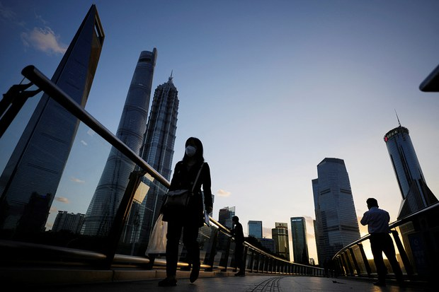

# “谈论中国复苏为时过早” 西方公司对中国经济表失望

Author: None

Publisher: Radio Free Asia (Organization)

Published Time: 2023-05-07T15:46:00-04:00

Modified Time: 2023-05-07T16:05:13-04:00

Description: None

Videos: []

Audios: []

Images: ["[000000.png](000000.png)"]

<!--METADATA-->

 上海陆家嘴金融区的立交桥 路透社图片

从去年底到今年初，外界不少人预估中国今年的经济将有明显反弹，甚至有人说将有爆发性增长。但最近，与中国市场有关的西方公司纷纷对中国经济恢复过慢表达失望。

据英国《金融时报》报道，在中国颇为知名的美国化妆品集团雅诗兰黛上周降低了销售预测，导致其股价创下有史以来的最大单日跌幅，该公司把原因归结为亚洲的复苏比预期的更为波动、更为缓慢。

与此同时，星巴克等消费者连锁店和一些大型科技集团、物流企业两周来也多次发出警告，称预期中的重新开放后的中国市场反弹并没有出现。恩智浦半导体公司甚至认为，现在谈论中国复苏还为时过早。

但也有一些公司，例如阿迪达斯的股价在上周有所上涨，他们的报告指出，虽然公司在中国的收入下降，但正在看到积极的趋势。

在另一面，由于近来北京方面对一些外企采取了审查的手段，外企的增长预期也在发生改变。美国商会表示，中国的新反间谍法“极大地增加了在中华人民共和国经商的不确定性和风险”。

（责编：王允）

Source: [https://www.rfa.org/mandarin/Xinwen/7-05072023153347.html](https://www.rfa.org/mandarin/Xinwen/7-05072023153347.html)