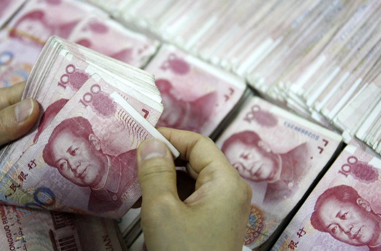

# 哈尔滨收入还不到支出的零头 地方财政恶化

Author: None

Publisher: Radio Free Asia (Organization)

Published Time: 2023-05-07T15:50:29-04:00

Modified Time: 2023-05-07T15:50:29-04:00

Description: None

Videos: []

Audios: []

Images: ["[000000.png](000000.png)"]

<!--METADATA-->

 哈尔滨收入还不到支出的零头 地方财政恶化 法新社图片

中国地方财政状况近来出现了恶化的趋势。据台湾中央社报道，哈尔滨市今年初发布的2022年预算执行情况报告披露，该市去年一般公共预算收入为262亿，支出却高达1545亿，收入还不及支出的零头。

另据网易公众号“慧翔百科”4月份的报道，全国有多个城市目前的财政自给率低于50%，除了哈尔滨之外，还有西宁40.52%、长春40.62%、重庆42.81%、南宁45.4%、银川45.45%，以及呼和浩特49.82%。

另据美国《华尔街日报》今年3月报道，目前中国经济正被地方政府的巨额债务所拖累。据中国官方统计，中国31个省级政府背负的债务总计约5.1万亿美元，这还不包括各种表外债务，即通过所谓的地方政府融资平台筹集的债务。

纽约研究机构荣鼎集团(RhodiumGroup)的调查显示，中国有三分之一的主要城市就连偿付所欠债务的利息都有困难，甘肃省会兰州市2021年的利息支出占财政收入的74%。

（责编：王允）

Source: [https://www.rfa.org/mandarin/Xinwen/8-05072023154717.html](https://www.rfa.org/mandarin/Xinwen/8-05072023154717.html)