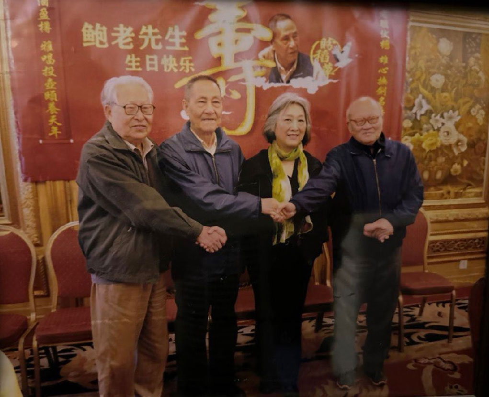

# 赵紫阳原智囊姚监复遭养老院监控

Author: None

Publisher: Radio Free Asia (Organization)

Published Time: 2023-05-08T00:50:00-04:00

Modified Time: 2023-05-08T07:27:07-04:00

Description: None

Videos: []

Audios: []

Images: ["[000000.png](000000.png)", "[000001.png](000001.png)", "[000002.png](000002.png)"]

<!--METADATA-->

赵紫阳原智囊姚监复与高瑜会晤，养老院护工不仅在旁录音，还粗暴阻止姚监复说话，并阻挡高瑜录像。 取自高瑜推特

年过90、曾任中国国务院研究员的学者姚监复近年在北京一家养老院颐养天年。近日有人揭发，姚监复受到养老院人员严密监控，日常生活失去自由，相信与他和前中共总书记赵紫阳的渊源有关。

* [ **中共改革派元老杜光去世 政改呼声从此绝响？** ](https://www.rfa.org/mandarin/yataibaodao/renquanfazhi/al-03152023092959.html)

姚监复自数年前起与妻子入住位于北京房山区的随园养老中心。近日他的好友、独立媒体人高瑜前往探望。养老院护工只准许姚监复在大门口与高瑜会晤，并严密监控整个过程。

高瑜：“他（姚监复）第一句话就跟我们说，‘什么都不让我写，我脑子越来越不好了，我觉得活着都没意思了。’马上那个女的就阻止他了。我们见面还没五分钟呢，那个女的就拉着他说，‘该吃饭了，该吃饭了。’姚老就一直说，‘你走吧，你走吧，我就想跟他们谈谈话。’”

姚监复要求护工给予私人空间，对方不仅拒绝，还阻挡高瑜录像。

高瑜:“那个女的一直给我们录着音。我们说什么话，她都在录音。姚老又跟我说，‘现在是文化大革命，是第二季。’我想把姚老这句话给录下来。这个女的都上前边来了，挡在姚老前面。我们说，‘你是服务员，你的责任是给他们服务。你到底是看守还是服务员？’不让他写作，不给执笔，你耳朵聋了，电话你也别接。你想想，这样一个思想活跃，经历极丰富，又有笔耕习惯的这样一个老人，多么痛苦！太残酷了！”

姚监复（右一）与赵紫阳前秘书鲍彤（左二）和好友高瑜（右二）合影。（高瑜提供，拍摄日期不详）  

**赵紫阳遭软禁期间曾与姚监复详谈**

年过90的姚监复，在1989年“六四”之前担任中共中央农村政策研究室、中国国务院农村发展研究中心研究员，当时被外界形容为时任中共总书记赵紫阳的智囊。1992年姚监复转任中国农业部农村经济研究中心研究员，并曾经与被软禁的赵紫阳详谈。高瑜相信，养老院是在当局压力下才对姚监复的访客严加防范。

高瑜：“他和赵紫阳的两次见面写了谈话记录，这是非常重要的原因。（当局）肯定把他认为是胡（胡耀邦）赵（赵紫阳）一派的。他回忆了六四前后的经过。”

中国前媒体人赵兰健说，以“服务”和“关照”为名进行监控，这种现象在中国十分普遍。

前媒体人赵兰健（图）说，以“服务”和“关照”为名进行监控的现象在中国十分普遍。（赵兰健独家提供，拍摄日期不详）  

赵兰健：“这养老设施一定是有书记的，也是有当地的居委会的，一定会对它有政治上的压力，或者旁敲侧击，去实施一些政府外围的计划。”

据了解，即使在搬进养老院之前，姚监复的寓所外面也长期有人站岗，他日常出门也会有人跟踪。

记者：高锋 责编：陈美华 许书婷 网编：瑞哲

Source: [https://www.rfa.org/mandarin/yataibaodao/renquanfazhi/gf-05082023004546.html](https://www.rfa.org/mandarin/yataibaodao/renquanfazhi/gf-05082023004546.html)